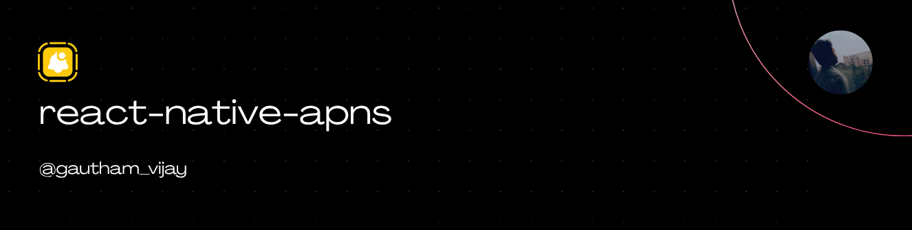

<a href="https://gauthamvijay.com">
  <picture>
    
  </picture>
</a>

# react-native-apns

A **React Native TurboModule** that bridges Apple’s **APNs (Apple Push Notification Service)** APIs for iOS.  
This library lets your React Native app or App Clip **request push-notification permission**, **register with APNs**, and **retrieve the device token** needed to send push notifications from your backend.

> [!NOTE]
>
> - This library was originally built for my work app, which uses the Bare React Native CLI (non-Expo).
> - I’ve open-sourced it so the wider React Native community can easily integrate APNS Support.
> - Pull requests are welcome — especially for Expo support (via custom config plugins) or additional native enhancements.

---

## 📦 Installation

```
npm install react-native-apns
```

Then install pods:

```
cd ios && pod install
```

---

> [!IMPORTANT]
>
> - iOS only (works for full apps, App Clips, and extensions).
> - The library does **not** handle local or scheduled notifications — it focuses purely on **permission** and **token registration**.

---

## ✅ Required native setup (must-do)

Enable Push Notifications capability in Xcode

In Xcode, select your App target (and App Clip target if used) → Signing & Capabilities → + Capability → Push Notifications.

Set aps-environment entitlement

Xcode will add an entitlements file automatically when you add Push Notifications. Confirm your \*.entitlements file contains:

```
<key>aps-environment</key>
<string>development</string>
```

Use development for debug builds; production for App Store / production provisioning.

App ID / Provisioning profile

In Apple Developer portal, for your App ID (and App Clip App ID), enable Push Notifications.

Recreate/download provisioning profiles so they include the push entitlement and install them in Xcode.

---

## 🧰 AppDelegate Setup

In your **AppDelegate.swift**, add:

```swift
func application(_ application: UIApplication,
                 didRegisterForRemoteNotificationsWithDeviceToken deviceToken: Data) {
  UserDefaults.standard.set(deviceToken, forKey: "AppClipAPNSToken")
}

func application(_ application: UIApplication,
                 didFailToRegisterForRemoteNotificationsWithError error: Error) {
  print("❌ Failed to register for APNs:", error.localizedDescription)
}
```

> These callbacks are required — they’re how iOS delivers the token back to your app.

---

## 🔗 Reference Links

- 📘 Apple Docs: [Registering for Remote Notifications](https://developer.apple.com/documentation/uikit/uiapplication/1623078-registerforremotenotifications)
- 🔔 Apple Docs: [Handling Notifications in Your App](https://developer.apple.com/documentation/usernotifications)
- 🧾 Apple Developer: [About Push Notifications](https://developer.apple.com/notifications/)

---

##  Why This Library Exists

Most React Native push libraries wrap Firebase or third-party SDKs.
If you only need **native APNs registration** — for enterprise, App Clips, or direct APNs backends — this lightweight module does exactly that and nothing more.

Built for production use in real apps, now open-sourced for the community.

---

## 🧠 What It Does

This module wraps Apple’s `UNUserNotificationCenter` and `UIApplication` APIs and exposes:

```ts
{
  requestNotificationPermission(): Promise<boolean>;
  getAPNSToken(): Promise<string>;
}
```

Example token (hex):

```
b0f6c67e7e81f9fa5e6c29163ce3a4b7e61d4c390f021f173b7d69c4e6c9c812
```

---

## ⚙️ Usage

```tsx
import APNs from 'react-native-apns';
import { Alert } from 'react-native';

export async function registerForPush() {
  try {
    const granted = await APNs.requestNotificationPermission();
    if (!granted) {
      Alert.alert(
        'Notifications Disabled',
        'Enable notifications in Settings.'
      );
      return;
    }

    const token = await APNs.getAPNSToken();
    console.log('📲 APNs Token:', token);

    // Send to your backend for push targeting
    await fetch('https://your-backend.com/api/register-token', {
      method: 'POST',
      headers: { 'Content-Type': 'application/json' },
      body: JSON.stringify({ token }),
    });
  } catch (err: any) {
    Alert.alert('Error', err.message);
  }
}
```

---

## 🧩 Supported Platforms

| Platform                     | Status                 |
| ---------------------------- | ---------------------- |
| **iOS (13+)**                | ✅ Fully supported     |
| **App Clip**                 | ✅ Supported           |
| **Android**                  | 🚫 Not applicable      |
| **Web**                      | 🚫 Not applicable      |
| **Expo (Custom Dev Client)** | ✅ Works automatically |

---

## 🛠️ Under the Hood

This module wraps:

```
UNUserNotificationCenter.requestAuthorization(options)
UIApplication.registerForRemoteNotifications()
application:didRegisterForRemoteNotificationsWithDeviceToken
```

and saves the resulting token into `NSUserDefaults` (or App Group if configured)
so the JS layer can safely retrieve it via TurboModule.

---

## 🧱 Example Server Endpoint (Node Express)

```js
import express from 'express';
const app = express();
app.use(express.json());

app.post('/register-token', (req, res) => {
  const { token } = req.body;
  console.log('📲 Registered APNs token:', token);
  res.json({ success: true });
});

app.listen(3000, () => console.log('✅ Backend running on port 3000'));
```

---

## 📅 Roadmap

- ✅ TurboModule bridge implementation
- ✅ Works for App Clips and full apps
- ✅ AppDelegate integration docs
- 🚧 Add App Group shared storage example
- 🚧 Add SwiftUI example snippet

---

## 🤝 Contributing

Pull requests are welcome — especially improvements for Swift extensions or App Group support!

- [Development workflow](CONTRIBUTING.md#development-workflow)
- [Sending a pull request](CONTRIBUTING.md#sending-a-pull-request)
- [Code of conduct](CODE_OF_CONDUCT.md)

---

## 🪪 License

MIT © [Gautham Vijayan](https://gauthamvijay.com)

---

Made with [create-react-native-library](https://github.com/callstack/react-native-builder-bob)
